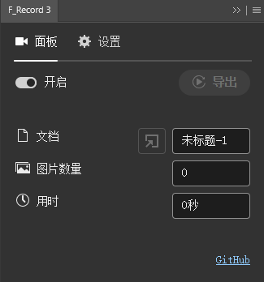
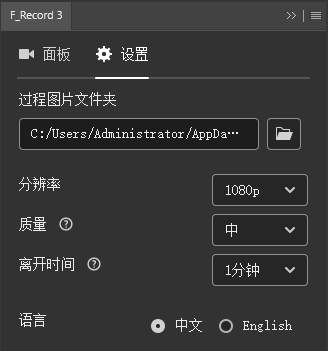

# F_Record介绍

一款用来录制绘画过程的轻量级PS插件。

**插件原理**：调用PS生成器的接口，当画布发生变化时截取过程图片，最后将图片连起来生成录像。

**当前插件版本**：3.0

**支持系统**：Windows（后面会适配Macos）

**支持PS版本**：PS 2022 ~ 2025

## 安装方法

1. 下载插件压缩包[F_Record.zip](https://github.com/F-know/F_Record/releases/download/3.0/F_Record.zip)，解压，打开文件夹。

2. 将内部的两个文件夹`com.f_know.f_record.cep`和`com.f_know.f_record.generator`放到PS主目录下的相应位置。
   PS主目录的路径形如`D:\Adobe Photoshop 2022`。
   判断有没有找对是看其中有没有PS的可执行文件`Photoshop.exe`，而不是快捷方式。

    • 将`com.f_know.f_record.cep`文件夹放到形如`D:\Adobe Photoshop 2022\Required\CEP\extensions`的路径下。

    • 将`com.f_know.f_record.generator`文件夹放到形如`D:\Adobe Photoshop 2022\Plug-ins\Generator`的路径下。

    注意，有可能你的PS下缺少某个路径，比如Plug-ins下没有Generator文件夹，这时需要你手动创建一个。

3. 打开PS，依次点开"编辑-首选项-增效工具"，看看"启用生成器"和"载入扩展面板"是否勾选。
   如果没有勾选，则需要勾上后重启PS，如果已经勾选，则不需要重启。

4. 最后，在PS的"窗口-扩展（旧版）"中就能找到插件，点开后即可正常使用。